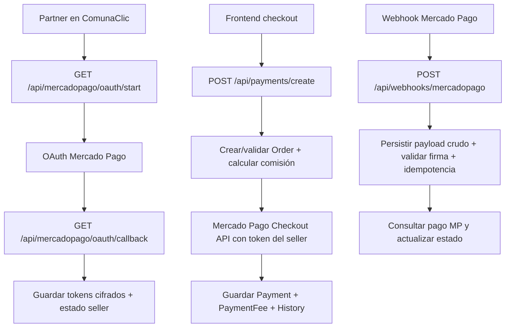

# ComunaClic Marketplace Mercado Pago Chile

Implementación de marketplace para `app.comunaclic.cl` donde cada vendedor conecta su propia cuenta de Mercado Pago vía OAuth y ComunaClic retiene una comisión por operación sin recaudar manualmente los fondos de terceros.

## Arquitectura

- `src/ComunaClick.Api/Modules/Marketplace`
  - OAuth seller-to-platform con Mercado Pago.
  - Checkout API como flujo principal.
  - Checkout Pro como fallback desacoplado.
  - Webhooks idempotentes y sincronización manual.
  - Auditoría, métricas simples y endpoint de salud.
- `src/ComunaClick.Api/Persistence`
  - Nuevas entidades: `Seller`, `SellerMercadoPagoAccount`, `SellerFeeConfiguration`, `PaymentFee`, `WebhookEvent`, `PaymentStatusHistory`, `AuditLog`.
  - Ampliaciones de `Order` y `Payment` para trazabilidad marketplace.
- `src/ComunaClick.Shared` y `src/ComunaClick.SharedUI`
  - Contratos compartidos.
  - UI mínima para partners: conexión, estado, comisión, listado/detalle de pagos y reintento de sync.
- `tests/ComunaClick.Tests.Unit`
  - Tests de `FeeCalculator`.
  - Test básico de idempotencia de webhook.

## Flujo



## Variables de entorno

Definir como mínimo:

- `MP_CLIENT_ID`
- `MP_CLIENT_SECRET`
- `MP_REDIRECT_URI`
- `MP_WEBHOOK_SECRET`
- `MP_API_BASE_URL`
- `DATABASE_CONNECTION_STRING`
- `APP_BASE_URL`
- `ENCRYPTION_KEY`
- `JWT__ISSUER`
- `JWT__AUDIENCE`
- `JWT__SIGNINGKEY`

`ENCRYPTION_KEY` debe ser base64 de 16/24/32 bytes o una cadena suficientemente larga para derivar 32 bytes.

## Configuración de la app Mercado Pago

1. Crear la aplicación marketplace en el panel de desarrolladores de Mercado Pago Chile.
2. Configurar `Redirect URI`:
   - `https://api.comunaclic.cl/api/mercadopago/oauth/callback`
3. Configurar webhook:
   - `https://api.comunaclic.cl/api/webhooks/mercadopago`
4. Guardar `client_id`, `client_secret` y secreto de webhook en variables de entorno.
5. Confirmar que la app esté habilitada para operar en modo marketplace/split para Chile.

## Cómo conectar un vendedor

1. El partner entra a `/partner/mercadopago`.
2. Presiona `Conectar Mercado Pago`.
3. El frontend llama `GET /api/mercadopago/oauth/start?sellerId=...`.
4. Se redirige al consentimiento OAuth de Mercado Pago.
5. El callback guarda:
   - `seller_id`
   - `mp_user_id`
   - `access_token_encrypted`
   - `refresh_token_encrypted`
   - `token_expires_at`
   - `scope`
   - `connection_status`
   - `connected_at`

## Cómo crear un pago

Endpoint principal:

- `POST /api/payments/create`

Ejemplo `checkout_api`:

```json
{
  "sellerId": "9b4f8a06-1f2a-42d8-bca9-3ab6eb4c4b65",
  "buyer": {
    "email": "buyer@correo.cl",
    "name": "María Buyer",
    "identificationType": "RUT",
    "identificationNumber": "11111111-1"
  },
  "items": [
    {
      "sku": "svc-manicura",
      "title": "Manicura permanente",
      "quantity": 1,
      "unitPrice": 18990
    }
  ],
  "paymentToken": "CARD_TOKEN_FROM_FRONTEND",
  "paymentMethodId": "master",
  "installments": 1,
  "description": "Reserva ComunaClic",
  "flow": "checkout_api",
  "idempotencyKey": "cc-ord-0001"
}
```

Respuesta ejemplo:

```json
{
  "paymentId": "0f55f1f3-f68f-40a8-a9c5-8f1fb50f8c70",
  "orderId": "4bb8dfe5-8215-4660-8e2e-a49b751b5b1a",
  "sellerId": "9b4f8a06-1f2a-42d8-bca9-3ab6eb4c4b65",
  "flow": "checkout_api",
  "provider": "mercadopago",
  "status": "pending",
  "statusDetail": "pending_contingency",
  "currency": "CLP",
  "grossAmount": 18990,
  "platformFeeAmount": 1900,
  "netAmount": 17090,
  "externalReference": "cc-order-3a5f...",
  "mercadoPagoPaymentId": "1234567890",
  "checkoutUrl": null,
  "correlationId": "f9f6c7fd8e2d4c51a2e26d2db98ae8d6"
}
```

## Cómo simular webhook

Ejemplo:

```bash
curl -i -X POST "https://api.comunaclic.cl/api/webhooks/mercadopago" \
  -H "Content-Type: application/json" \
  -H "x-request-id: local-test" \
  -H "x-signature: ts=1710000000,v1=firma_aqui" \
  -d '{
    "type": "payment",
    "action": "payment.updated",
    "data": { "id": "1234567890" }
  }'
```

La implementación siempre guarda el payload crudo en `core.webhook_events`. Si el `resource_id` ya fue procesado con el mismo `topic/action`, el evento entra por ruta idempotente.

## Sandbox

1. Usar credenciales sandbox de la app MP.
2. Configurar `MP_API_BASE_URL=https://api.mercadopago.com`.
3. Vincular vendedor sandbox por OAuth.
4. Usar tarjetas/tokenización sandbox desde el frontend.
5. Verificar:
   - creación de `Order`
   - `Payment`
   - `PaymentFee`
   - `PaymentStatusHistory`
   - `WebhookEvents`

## Producción

1. Ejecutar `infra/migrations/2026-04-23_marketplace_mercadopago.sql`.
2. Configurar variables reales en entorno productivo.
3. Probar OAuth con una cuenta vendedora chilena real.
4. Validar webhook firmado desde Mercado Pago.
5. Ejecutar smoke de:
   - conectar vendedor
   - guardar comisión
   - crear pago
   - recibir webhook
   - consultar listado y detalle

## Endpoints implementados

- `GET /api/mercadopago/oauth/start?sellerId=...`
- `GET /api/mercadopago/oauth/callback`
- `POST /api/payments/create`
- `GET /api/payments/{id}`
- `GET /api/payments/order/{orderId}`
- `POST /api/webhooks/mercadopago`
- `GET /api/sellers/{sellerId}/mercadopago/status`
- `POST /api/sellers/{sellerId}/mercadopago/disconnect`
- `PUT /api/sellers/{sellerId}/fees`
- `GET /api/sellers/{sellerId}/payments`
- `POST /api/payments/{id}/sync`
- `GET /api/marketplace/health`

## Estructura de carpetas propuesta

```text
src/
  ComunaClick.Api/
    Modules/Marketplace/
    Persistence/Entities/
  ComunaClick.Shared/
    Api/Partner/
  ComunaClick.SharedUI/
    Pages/Partner/
tests/
  ComunaClick.Tests.Unit/
infra/
  migrations/
docs/
  postman/
```

## Troubleshooting

- `Seller Mercado Pago account was not found`
  - El partner no completó OAuth o fue desconectado.
- `Seller Mercado Pago account is not connected`
  - `connection_status` no está en `connected`.
- `Platform fee cannot exceed gross amount`
  - La configuración fija/porcentual supera el monto bruto.
- `403` en endpoints seller
  - El usuario autenticado no coincide con el `sellerId` o no tiene rol adecuado.
- Webhook rechazado por firma
  - Revisar `MP_WEBHOOK_SECRET` y el algoritmo de firma vigente.
- Pago no cambia de estado
  - Verificar que MP esté llamando el webhook y que el seller mantenga token válido.

## Observaciones técnicas y decisiones tomadas

- `sellerId` se alinea con `Partner.Id` existente para no duplicar identidad de comercio.
- Se usó validación manual/equivalente en servicios y controladores, sin introducir más paquetes que los estrictamente necesarios.
- Checkout API quedó como flujo principal; Checkout Pro quedó soportado como ruta alternativa desacoplada.
- La firma de webhook se validó con el esquema HMAC actualmente modelado en cliente. Si Mercado Pago cambia el formato oficial, el ajuste queda concentrado en `MercadoPagoMarketplaceClient.ValidateWebhookSignature`.
- El script SQL crea `core.sellers` y además backfillea registros desde `core.partners` para facilitar adopción en un sistema ya en marcha.
