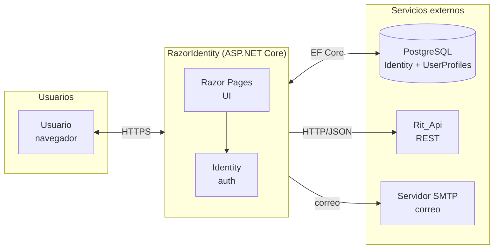
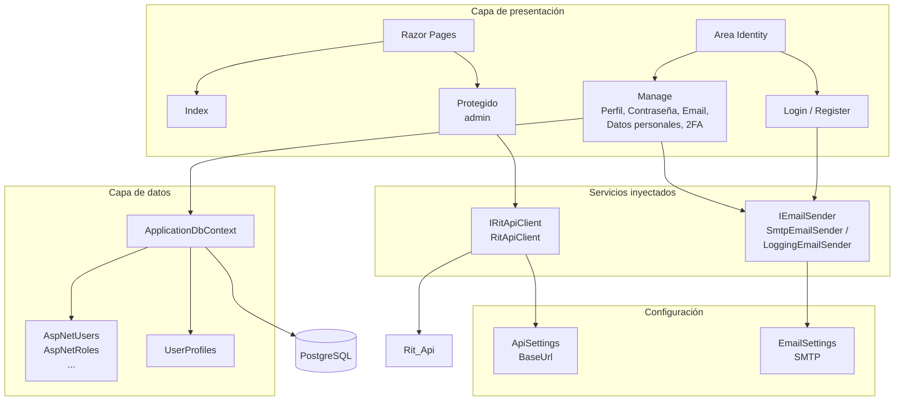
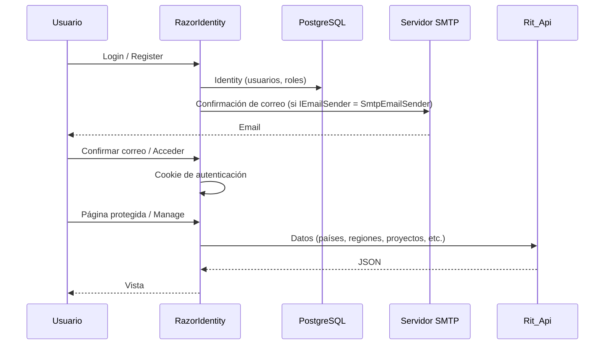
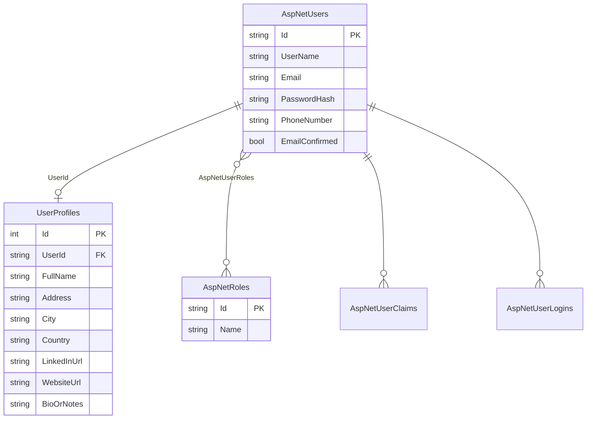
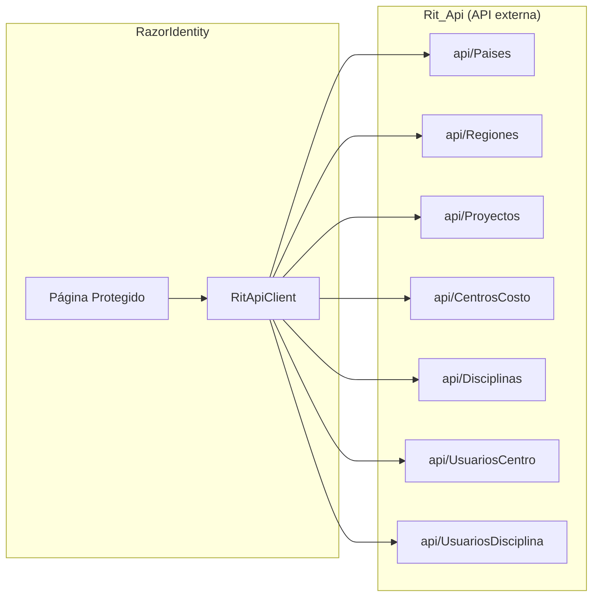

# Diagrama de la aplicación RazorIdentity y servicios

Este documento contiene diagramas generados con **Mermaid** que describen la arquitectura de la aplicación RazorIdentity, sus componentes y la relación con servicios externos. Debajo de cada diagrama se incluye una **explicación** de qué representa y **por qué es útil** diseñar o usar la aplicación de esta forma, tanto para mantener el código como para incorporar nuevos desarrolladores al proyecto.

---

## 1. Vista general: sistema y actores

**Qué muestra:** Quién interactúa con la aplicación (el usuario desde el navegador) y con qué sistemas externos se comunica RazorIdentity: la base de datos PostgreSQL (Identity y perfiles), la API Rit_Api y el servidor de correo SMTP.

**Por qué es bueno este enfoque:**
- Separa claramente **tu aplicación** de **dependencias externas**: si Rit_Api o el correo fallan, la app puede seguir sirviendo login y páginas que no dependan de ellos.
- Todo el tráfico de usuario pasa por una sola aplicación (RazorIdentity), lo que simplifica seguridad, HTTPS y despliegue.
- La base de datos es el único almacenamiento persistente propio; Rit_Api y SMTP son servicios que se consumen, no se mantienen dentro del mismo proceso.

---

## 2. Componentes internos y servicios

**Qué muestra:** Cómo se organiza la aplicación por dentro: la **capa de presentación** (Razor Pages y el área Identity), los **servicios** que se inyectan (cliente de Rit_Api y envío de correo), la **capa de datos** (DbContext, tablas de Identity y UserProfiles) y la **configuración** que usan esos servicios.

**Por qué es bueno este enfoque:**
- **Inyección de dependencias:** Las páginas no crean directamente el cliente HTTP ni el envío de correo; reciben interfaces (`IRitApiClient`, `IEmailSender`). Así puedes cambiar implementaciones (por ejemplo, LoggingEmailSender en desarrollo y SmtpEmailSender en producción) sin tocar las páginas.
- **Separación de responsabilidades:** La UI solo orquesta; la lógica de negocio y el acceso a datos están en servicios y DbContext. Facilita pruebas y mantenimiento.
- **Configuración centralizada:** La URL de la API y los datos SMTP salen de `appsettings`, no del código, lo que permite distintos entornos (desarrollo, producción) sin recompilar.

---

## 3. Flujo de autenticación y correo

**Qué muestra:** El orden en el tiempo de las interacciones: el usuario se registra o inicia sesión, la app consulta Identity en PostgreSQL y puede enviar correo de confirmación; después el usuario confirma y accede, y cuando entra en páginas protegidas la app puede llamar a Rit_Api para obtener datos y devolver la vista.

**Por qué es bueno este enfoque:**
- Deja claro **dónde** se usa la base de datos (autenticación y perfiles) y **dónde** la API externa (datos de negocio como países o proyectos), evitando mezclar responsabilidades.
- Muestra que el correo es opcional (solo si está configurado SmtpEmailSender) y que Rit_Api se usa después de autenticarse, lo que ayuda a diseñar permisos y manejo de errores (por ejemplo, qué mostrar si Rit_Api no responde).
- Sirve como guión para pruebas manuales o automatizadas (registro → correo → confirmación → acceso → página protegida).

---

## 4. Modelos de datos (entidades principales)

**Qué muestra:** Las tablas principales que usa la aplicación en PostgreSQL: las de Identity (`AspNetUsers`, `AspNetRoles`, etc.) y la tabla propia `UserProfiles`, con la relación 1:1 entre usuario (Identity) y perfil extendido (UserId).

**Por qué es bueno este enfoque:**
- **Identity intacto:** No se modifican las tablas estándar de ASP.NET Identity; solo se añade `UserProfiles` vinculada por `UserId`. Las actualizaciones de Identity siguen siendo compatibles.
- **Un perfil por usuario:** El índice único en `UserId` garantiza que no haya duplicados y que las consultas por usuario sean sencillas.
- Tener el diagrama ER en el repo ayuda a cualquier desarrollador a entender el esquema sin abrir la base de datos y a diseñar nuevas tablas o migraciones de forma coherente.

---

## 5. Integración con Rit_Api (endpoints consumidos)

**Qué muestra:** Qué recursos de Rit_Api consume la página Protegido a través del mismo cliente HTTP: catálogos (países, regiones, proyectos, centros de costo, disciplinas) y asignaciones (usuarios por centro, usuarios por disciplina).

**Por qué es bueno este enfoque:**
- **Un solo cliente reutilizable:** Todas las llamadas pasan por `RitApiClient` (y la interfaz `IRitApiClient`), con una base URL y cabeceras comunes. Si mañana cambia la autenticación o la URL, se toca un solo sitio.
- **Contrato claro con la API:** La lista de endpoints documenta qué debe exponer Rit_Api para que la app funcione; facilita el trabajo en equipo entre front (RazorIdentity) y back (Rit_Api).
- Si un endpoint falla o se depreca, el diagrama indica qué funcionalidad de la página Protegido puede verse afectada y qué hay que ajustar o sustituir.

---

## 6. Resumen de tecnologías

| Componente        | Tecnología / detalle                          |
|-------------------|------------------------------------------------|
| App web            | ASP.NET Core 8, Razor Pages                    |
| Autenticación      | ASP.NET Core Identity (IdentityUser, roles)   |
| Base de datos     | PostgreSQL (Npgsql.EntityFrameworkCore)       |
| ORM               | Entity Framework Core 8                        |
| API externa       | Rit_Api (HTTP/JSON, BaseUrl en ApiSettings)   |
| Correo            | IEmailSender → SmtpEmailSender o LoggingEmailSender |
| Configuración     | appsettings.json (ApiSettings, EmailSettings, ConnectionStrings) |

---

## Resumen: ventajas de documentar la app con diagramas

- **Onboarding:** Un nuevo miembro del equipo puede leer este documento y entender en poco tiempo con qué sistemas habla la app y cómo está organizada por dentro.
- **Toma de decisiones:** Antes de añadir una nueva funcionalidad (por ejemplo, otro proveedor de correo o una segunda API), se ve dónde encaja y qué componentes tocar.
- **Operaciones y soporte:** Si algo falla (Rit_Api, correo, base de datos), los diagramas ayudan a acotar el problema y a explicar el flujo a soporte o a otros equipos.
- **Mermaid en el repo:** Los diagramas viven como código en Markdown, se versionan con el proyecto y se pueden ver en GitHub/GitLab o en cualquier editor que renderice Mermaid, sin depender de herramientas externas.

---

Para visualizar los diagramas Mermaid puedes:

- Usar [Mermaid Live Editor](https://mermaid.live/)
- Visual Studio Code con extensión "Mermaid"
- GitHub/GitLab (renderizan Mermaid en archivos `.md`)
